# module_1

## Описание задания   
Образец задания для демонстрационного экзамена по комплекту оценочной документации.  

### Модуль 1: Выполнение работ по проектированию сетевой инфраструктуры  
## **Задание 1 модуля 1** 
**1.	Выполните базовую настройку всех устройств:**  
**a.	Присвоить имена в соответствии с топологией:**  
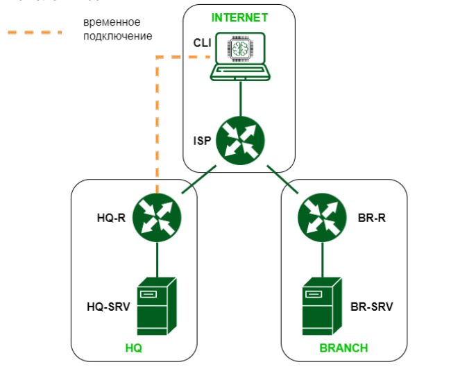  

### **ISP**
```
su -
toor
hostnamectl set-hostname ISP; exec bash
нажать enter
```

### **CLI**
```
su -
toor
hostnamectl set-hostname CLI; exec bash
нажать enter
``` 

### **HQ-R**
```
su -
toor
hostnamectl set-hostname HQ-R; exec bash
нажать enter
```

### **HQ-SRV**
```
su -
toor
hostnamectl set-hostname HQ-SRV; exec bash
нажать enter
```

### **BR-R**
```
su -
toor
hostnamectl set-hostname BR-R; exec bash
нажать enter
```


### **BR-SRV**

```
su -
toor
hostnamectl set-hostname BR-SRV; exec bash
нажать enter
```

**b.	Рассчитайте IP-адресацию IPv4 и IPv6. Необходимо заполнить таблицу №1, чтобы эксперты могли проверить ваше рабочее место.**  
**Таблица №1**  
| Имя устройства | IPv4            | IPv6                | Имя интерфейса |
|-----------------|-----------------|--------------------|----------------|
| CLI             | 10.0.1.2/24 255.255.255.0     | 2001:33::33/64       | 192 to ISP         |
| ISP             | 10.0.1.1/24 255.255.255.0     | 2001:33::1/64	       | ens192 ISP to CLI          |
|                 | 192.168.0.1/24 255.255.255.0     | 2001:11::1/64                   | ens224 ISP to HQ-R               |
|                 | 192.168.1.1/24 255.255.255.0     | 2001:22::1/64                   | ens256 ISP to BR-R              |
| HQ-R            | 192.168.0.2/24 255.255.255.0        | 2000:100::3f/122        | ens192 HQ-R to ISP           |
|                 | 10.0.0.1/26 255.255.255.0        |    2001:100::1/64		                | ens224 to HQ               |
| HQ-SRV          | 10.0.0.2/26 255.255.255.192        | 2000:100::1/122       | ens192 to HQ-R           |
| BR-R            | 192.168.1.2/24 255.255.255.0     | 2000:200::f/124       | ens160 BR-R to ISP           |
|                 | 10.0.2.1/28 255.255.255.240     | 2001:100::2/64	                   | ens192 to BR               |
| BR-SRV          | 10.0.2.2/28 255.255.255.240     | 2000:200::1/124       | ens192 to BR-R           |
| HQ-CLI          | 10.0.0.3/26 255.255.255.192        | 2000:100::5/122       |            |
| HQ-AD           | 10.0.0.4/26 255.255.255.192       | 2000:100::2/122       |            |  

**c.	Пул адресов для сети офиса BRANCH - не более 16**  

255.255.255.240 = /28  

**d.	Пул адресов для сети офиса HQ - не более 64**  

255.255.255.192 = /26  

## Настройка адресации  
**Назначаем адресацию согласно ранее заполненной таблицы №1**  

## **CLI**   

```
ip -c a
```
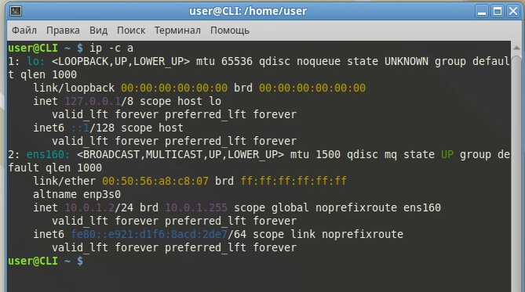  

## **ISP**  
```
su -
toor
enter
nmtui
```  
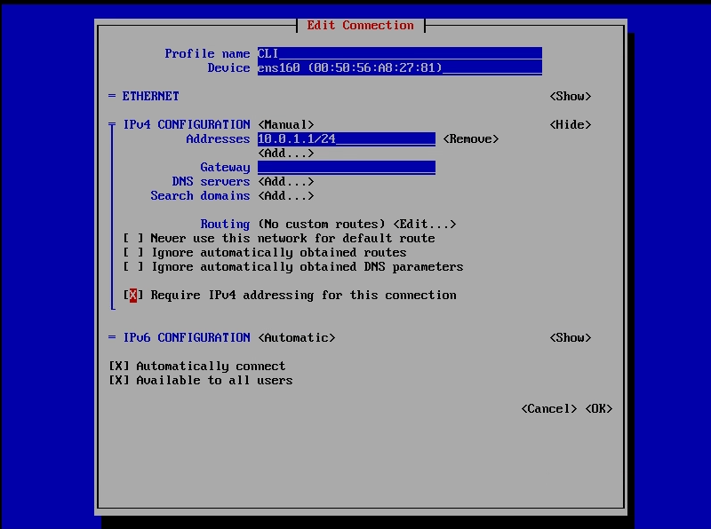  
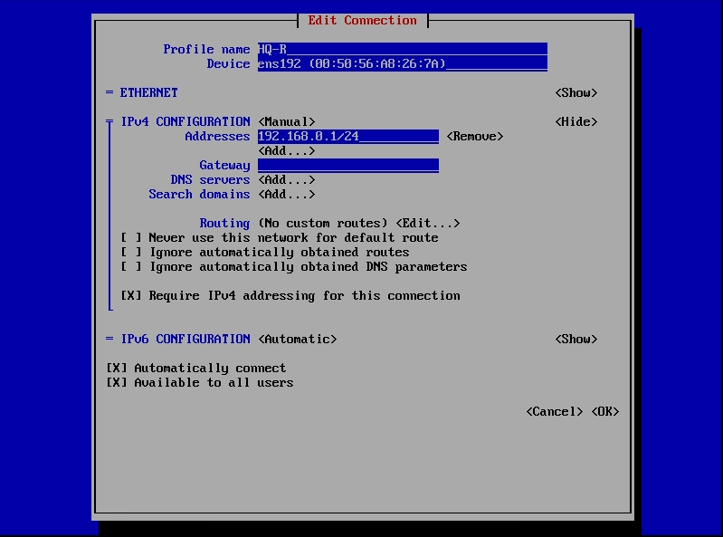  
После установки ip-адресов необходимо переподключить интерфейсы.  

Произведём настройку маршрута для CLI
```
ip route add default via 192.168.0.2
```

Необходимо включить опцию forwarding:  
```
nano /etc/net/sysctl.conf
ctrl-x
y
enter
```
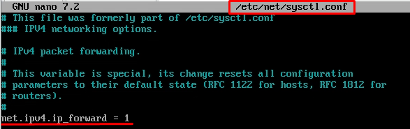  

```
systemctl restart network
ip -c a
```
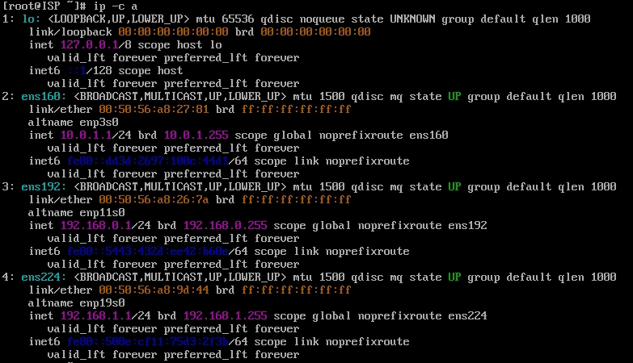   

## **HQ-R**  
```
su -
toor
enter
nmtui
```
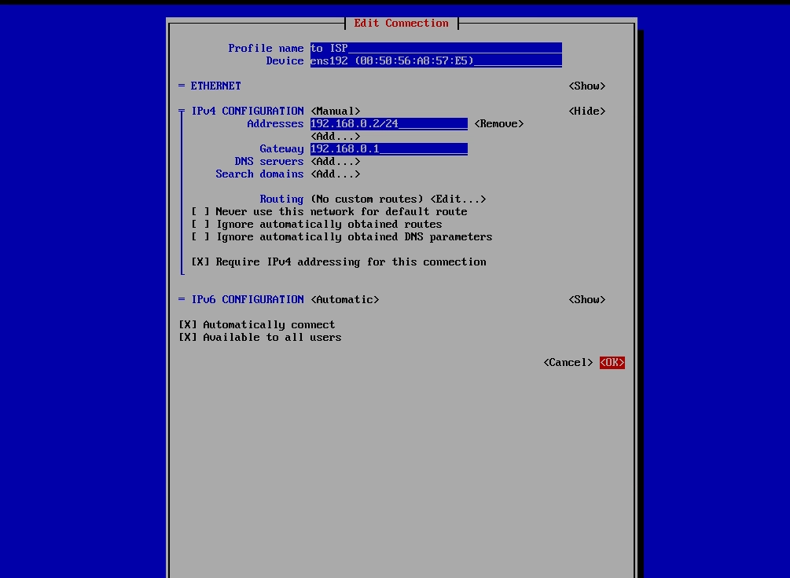
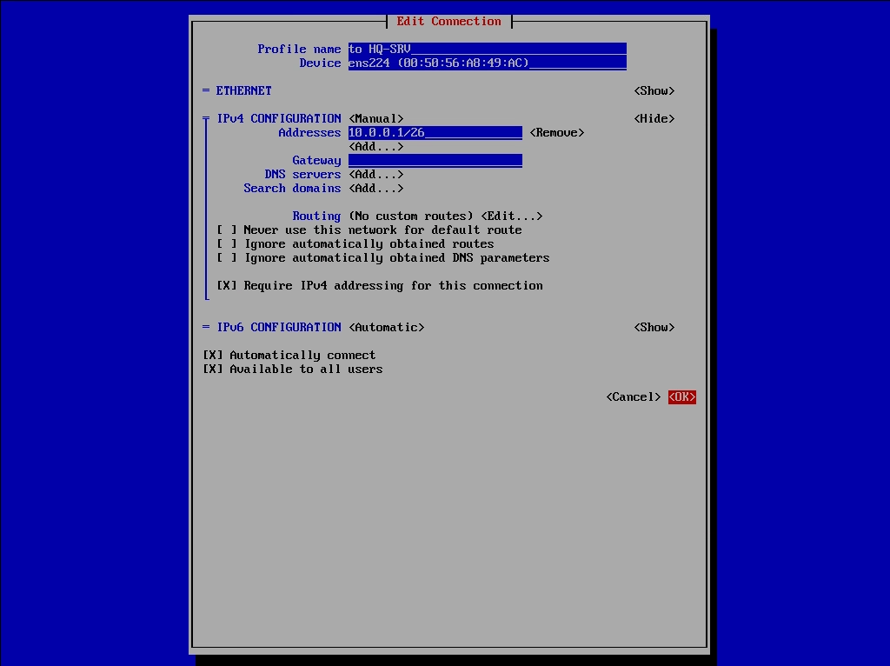

```
ctrl-x
y
enter
```
Необходимо включить опцию forwarding:  
```
nano /etc/net/sysctl.conf
ctrl-x
y
enter
```
  
```
systemctl restart network
ip -c a
```
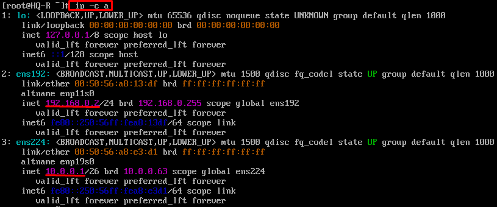

## **HQ-SRV**  
В дальнейшем на HQ-SRV подразумевается получение адреса по DHCP от HQ-R.  
Удостоверимся, что на интерфейсе установлено получение адресов через DHCP.

## **BR-R**  
```
su -
toor
enter
nmtui
```
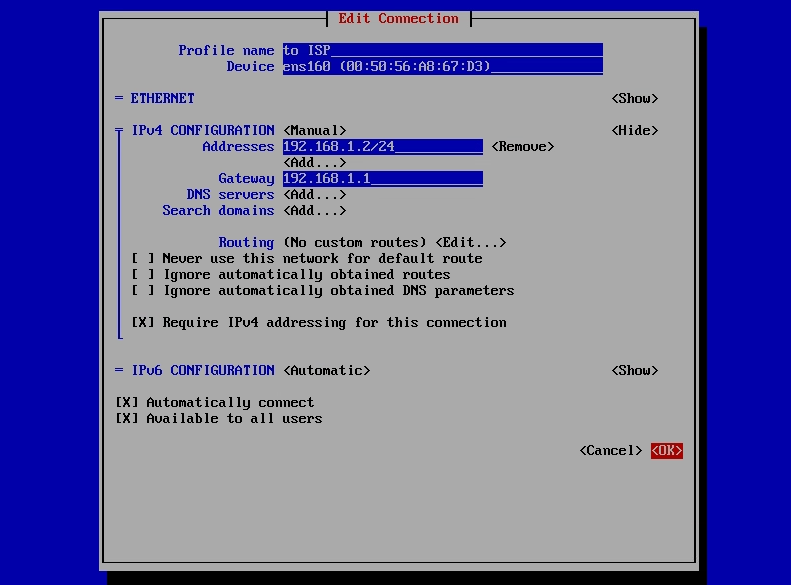  
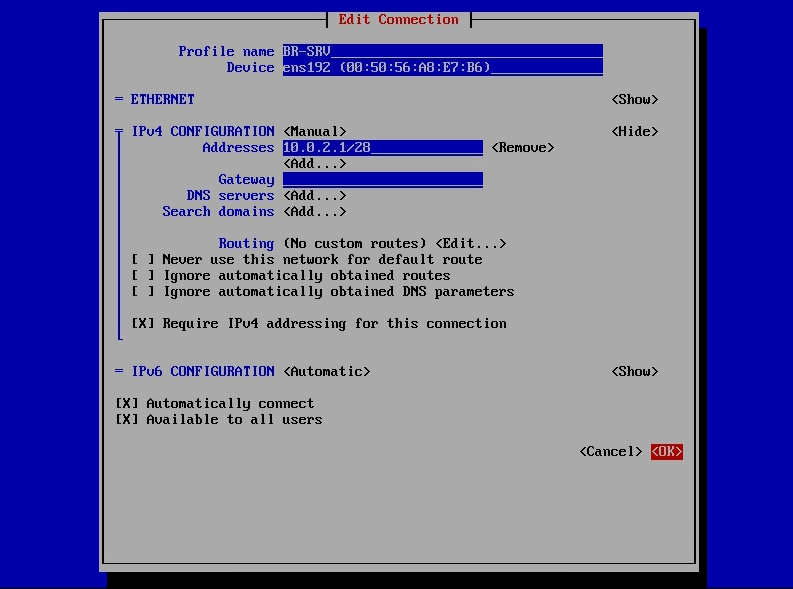  


Необходимо включить опцию forwarding:  
```
nano /etc/net/sysctl.conf
ctrl-x
y
enter
systemctl restart network
ip -c a
```
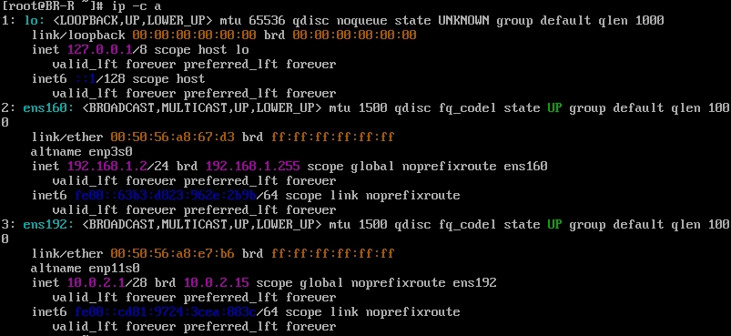  

## **BR-SRV**  

```
ip -c a
```
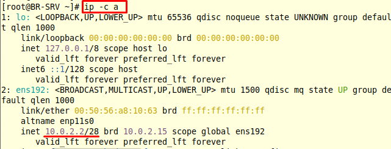

**2.	Настройте внутреннюю динамическую маршрутизацию по средствам FRR. Выберите и обоснуйте выбор протокола динамической маршрутизации из расчёта, что в дальнейшем сеть будет масштабироваться.**  
**Настройка FRR**  
Для настройки потребуется включённый forwarding, настройка выполнялась ранее.  

Предварительно настроем интерфейс туннеля:
## **HQ-R**
```
nmtui
``` 
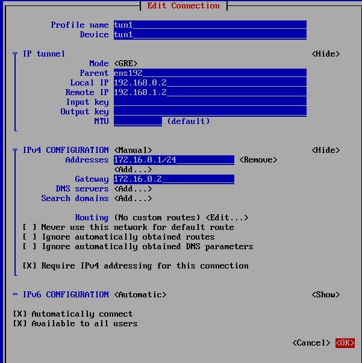  

## **BR-R**
```
nmtui
``` 
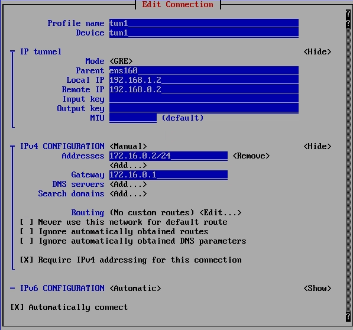  
 
## **HQ-R**

```
nano /etc/frr/daemons
меняем строчку
ospfd=no на строчку
ospfd=yes
```
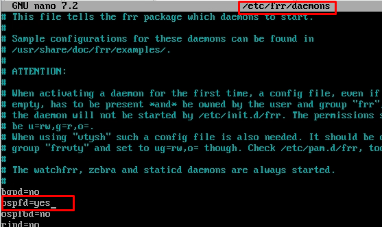  

```
ctrl-x
y
systemctl enable --now frr
vtysh
conf t
router ospf
passive-interface default
network 10.0.0.0/26 area 0
network 172.16.0.0/24 area 0
exit
interface tun1
no ip ospf network broadcast
no ip ospf passive
exit
do write memory
exit
```
Зададим TTL для OSPF  
```
nmcli connection edit tun1
set ip-tunnel.ttl 64
save
quit
```

Временно выключаем сервис службы **firewalld**  
```
systemctl stop firewalld.service
systemctl disable --now firewalld.service
```
```
systemctl restart frr
```

## **BR-R**

```
nano /etc/frr/daemons
меняем строчку
ospfd=no на строчку
ospfd=yes
```
  

```
ctrl-x
y
systemctl enable --now frr
vtysh
conf t
router ospf
passive-interface default
network 10.0.2.0/28 area 0
network 172.16.0.0/24 area 0
exit
interface tun1
no ip ospf network broadcast
no ip ospf passive
exit
do write memory
exit
```
Зададим TTL для OSPF  
```
nmcli connection edit tun1
set ip-tunnel.ttl 64
save
quit
```
Временно выключаем сервис службы **firewalld**  
```
systemctl stop firewalld.service
systemctl disable --now firewalld.service
```
```
systemctl restart frr
```
Проверим работу OSPF:  
```
show ip ospf neighbor
exit
```

**a.	Составьте топологию сети L3.**  

**Схема топологии L3**  
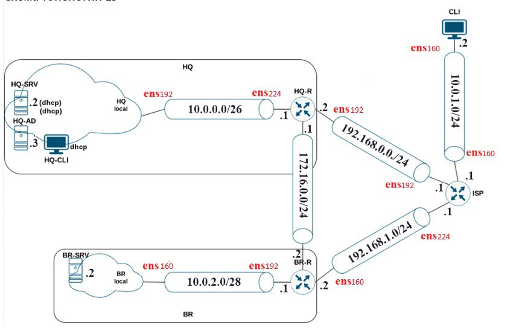    

**3.	Настройте автоматическое распределение IP-адресов на роутере HQ-R.**
**a.	Учтите, что у сервера должен быть зарезервирован адрес.**
## **HQ-R**
```
nano /etc/sysconfig/dhcpd
DHCPDARGS=ens224
ctrl-x
y
enter
```
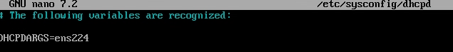  
```
cp /etc/dhcp/dhcpd.conf{.example,}
nano /etc/dhcp/dhcpd.conf
```
поправляем файл:  
  


Проверяем файл на правильность заполнения. Обратите внимание, что файл заполнен в точности со скриншотом выше. (фигурные скобки в начале и конце секции, знаки **;** и тд.)
```
dhcpd -t -cf /etc/dhcp/dhcpd.conf
```
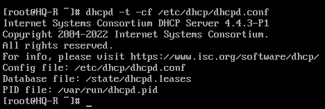   

```
systemctl enable --now dhcpd
systemctl status dhcpd
journalctl -f -u dhcpd
```

## **HQ-SRV**
```
systemctl restart network
```
После проделанных манирпуляций HQ-SRV должен получить статический адрес.
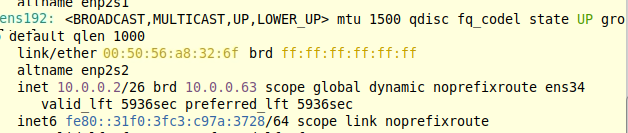  

**4.	Настройте локальные учётные записи на всех устройствах в соответствии с таблицей 2.**  
**Таблица №2**  

| Логин | Пароль | Примечание |
| :---         |     :---:      |          ---: |
| Admin   | P@ssw0rd     | CLI HQ-SRV HQ-R    |
| Branch admin     | P@ssw0rd       | BR-SRV BR-R      |
| Network admin     | P@ssw0rd       | HQ-R BR-R BR-SRV      |

## **CLI**  
Открываем центр управления системой, вводим пароль
Пароль: toor  
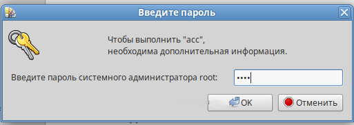  
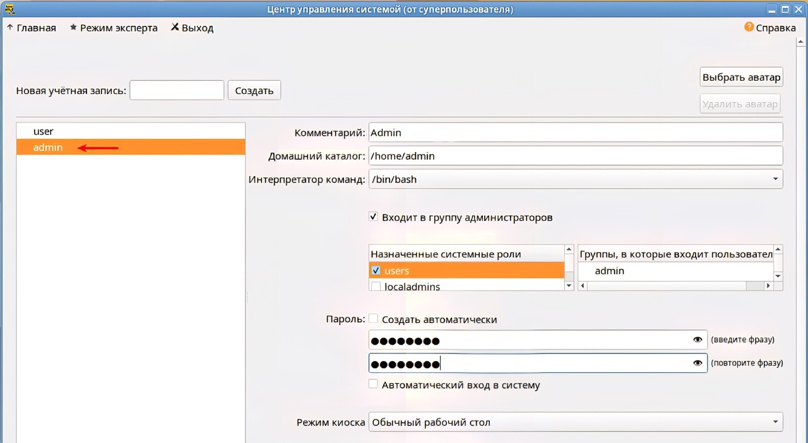

## **BR-R**

```
useradd branch-admin -m -c "Branch admin" -U
passwd branch-admin
useradd network-admin -m -c "Network admin" -U
passwd network-admin
```
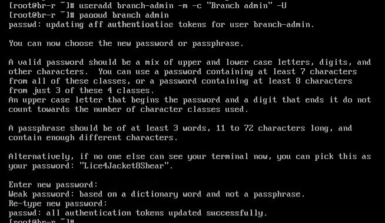  

**BR-SRV**
```
useradd branch-admin -m -c "Branch admin" -U
passwd branch-admin
useradd network-admin -m -c "Network admin" -U
passwd network-admin
```
  

## **HQ-R**

```
useradd network-admin -m -c "Network admin" -U
passwd network-admin
useradd admin -m -c "Admin" -U
passwd admin
```


## **HQ-SRV**
```
useradd admin -m -c "Admin" -U
passwd admin
```
  

**5.	Измерьте пропускную способность сети между двумя узлами HQ-R-ISP по средствам утилиты iperf 3. Предоставьте описание пропускной способности канала со скриншотами.**
## **ISP**

```
systemctl enable --now iperf3
```
## **HQ-R**
```
systemctl enable --now iperf3
iperf3 -c 192.168.0.1 -f m --get-server-output
```

По результату проверки сделать скриншот.  
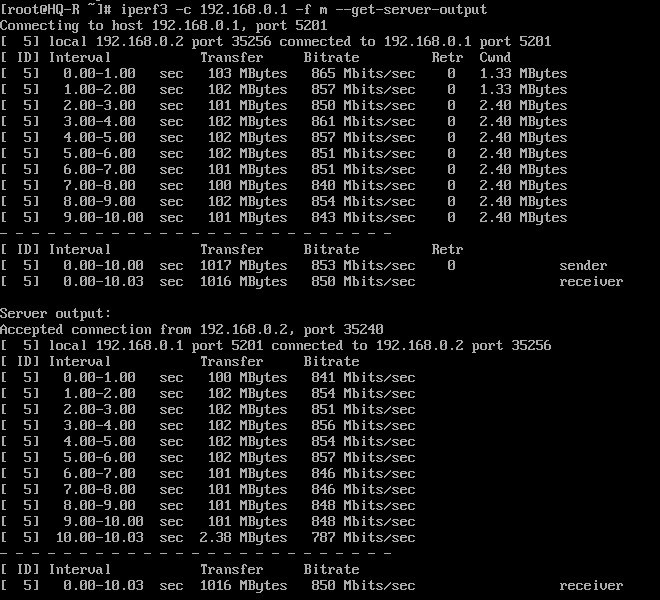  

**6.	Составьте backup скрипты для сохранения конфигурации сетевых устройств, а именно HQ-R BR-R. Продемонстрируйте их работу.**  

## **HQ-R**
Cоздадим дирректорию для сохранения файла:  
```
mkdir /opt/backup/
```
Запишем скрипт:  
```
nano backup-script.sh
```
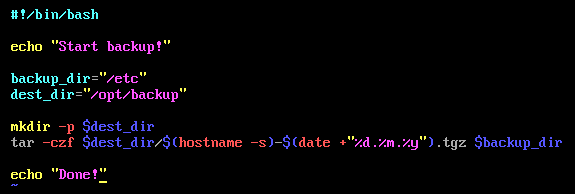  
```
ctrl-x
y
жмём enter
chmod +x backup-script.sh
./backup-script.sh
```
Проверим содержимое файла бэкапа. Обратите внимание, что название архива варьируется, в зависимости от даты, когда была сделана резервная копия!
```
tar -tf /opt/backup/hq-r-06.01.24.tgz | less
```

## **BR-R**
Cоздадим дирректорию для сохранения файла:  
```
mkdir /opt/backup/
```
Запишем скрипт: 
```
nano backup-script.sh
```
  
```
ctrl-x
y
жмём enter
chmod +x backup-script.sh
./backup-script.sh
```
Проверим содержимое файла бэкапа. Обратите внимание, что название архива варьируется, в зависимости от даты, когда была сделана резервная копия!
```
tar -tf /opt/backup/hq-r-06.01.24.tgz | less
```

**7.	Настройте подключение по SSH для удалённого конфигурирования устройства HQ-SRV по порту 2223. Учтите, что вам необходимо перенаправить трафик на этот порт посредством контролирования трафика.**
## **HQ-SRV**

```
nano /etc/openssh/sshd_config
```
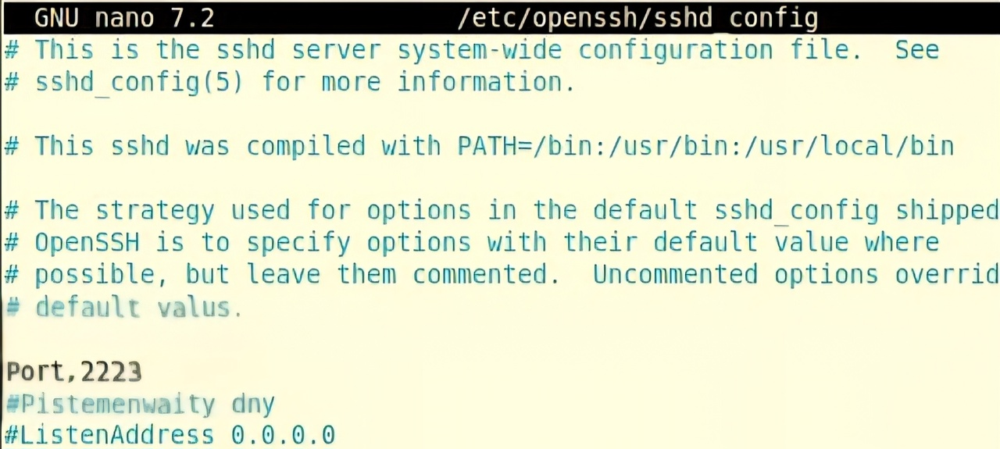  
```
ctrl-x
y
enter
systemctl restart sshd
```
## **HQ-R**
```
nft add table inet nat
nft add chain inet nat prerouting '{ type nat hook prerouting priority 0; }'
nft add rule inet nat prerouting ip daddr 192.168.0.2 tcp dport 22 dnat to 10.0.0.2:2222
nft list ruleset | tail -n 7 | tee -a /etc/nftables/nftables.nft
systemctl enable --now nftables
systemctl restart nftables
nft list ruleset
```
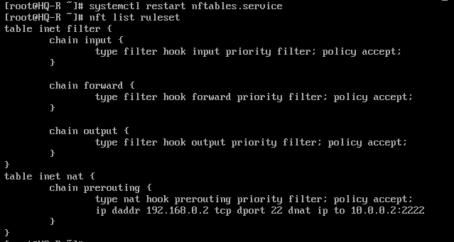  

Выполняем проверку подключения.   

**8.	Настройте контроль доступа до HQ-SRV по SSH со всех устройств, кроме CLI.**

## **HQ-SRV**

```
systemctl enable --now nftables.service
nft add rule inet filter input ip saddr 10.0.1.2 tcp dport 2222 counter drop
nano /etc/nftables/nftables.nft
```
Удаляем всё содержимое файла до закоментированных строк:  
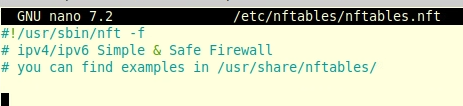  

```
nft list ruleset | tee -a /etc/nftables/nftables.nft
```
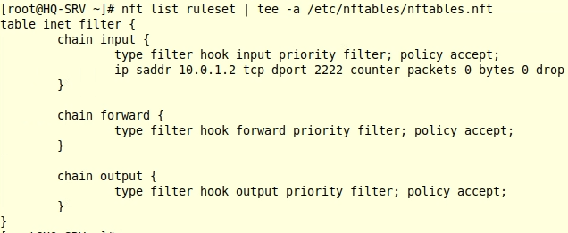  

```
systemctl restart nftables
nft list ruleset
```
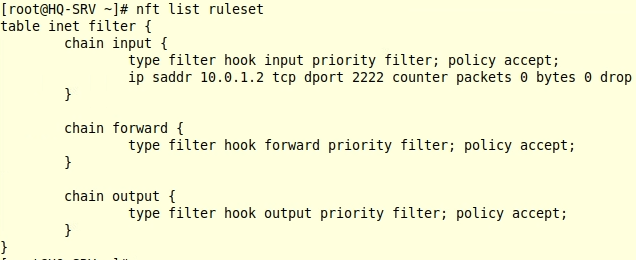  

Выполняем проверку:  
## **CLI**
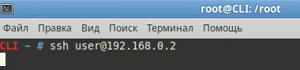  
В результате настройки, соединение с сервером **HQ-SRV** по ssh установить не удастся.  

